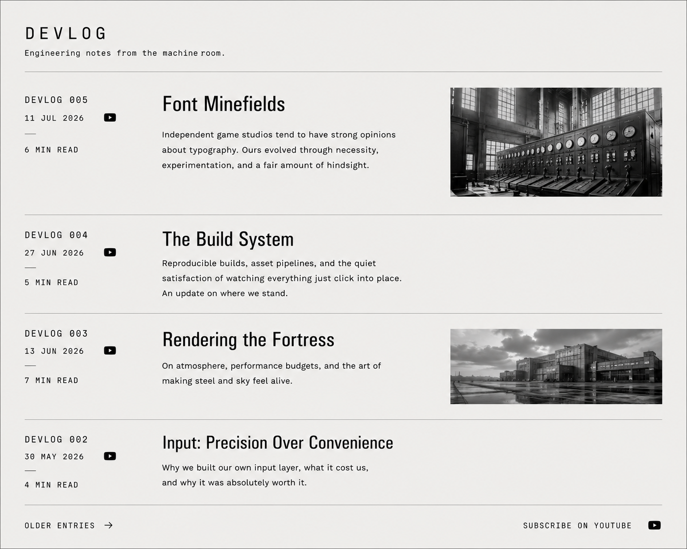

# REX Notes
## Observation 0 — Navigation precedes refinement

The current website technically works.

However, reading a post requires manually typing the URL.

This immediately makes the development workflow uncomfortable.

Although the roadmap originally placed the footer after most homepage work, practical use reveals that global navigation is a prerequisite for evaluating content.

Decision:

- Move footer implementation earlier.
- Provide basic navigation between homepage and articles.
- Add RSS entry point.
- Add YouTube entry point (vlog).

## Observation 1 — Third-party dependencies require tracking

### Observation

The website already relies on several third-party components:

- Hugo
- Tailwind CSS
- Google Fonts
- Lucide Icons

Additional third-party assets (music, illustrations, photographs, etc.) will likely be introduced over time.

### Analysis

Waiting until release to document licenses increases the risk of omissions and makes compliance more difficult.

Maintaining a living inventory alongside development is simpler, auditable, and scales naturally as new dependencies are introduced.

### Decision

Create and maintain a central third-party asset register from the start of the project.

The register shall record, for each dependency:

- Name
- Purpose
- Source
- License
- Local location
- License text location (when applicable)

The register becomes part of the engineering documentation and is updated whenever a new external dependency is introduced.

### Implementation idea

THIRD_PARTY_NOTICES.md

#### Example: Lucide Icons

- Usage: RSS, GitHub, YouTube icons
- Source: Lucide
- License: ISC
- License text: `third_party/licenses/LUCIDE-ISC.txt`
- Files used:
  - `static/icons/rss.svg`

#### Tree structure

third_party/
└── licenses/
    ├── LUCIDE-ISC.txt
    ├── TAILWIND-MIT.txt
    ├── HUGO-APACHE-2.0.txt
    ├── MARCELLUS-OFL-1.1.txt
    ├── B612-OFL-1.1.txt
    └── IBM-PLEX-MONO-OFL-1.1.txt

### Logo needs... making
 
#### Logo implementation notes

- Design the final emblem.
- Integrate the brand plaque in the header.
- Replace the temporary SVG.
- Generate the favicon set from the final logo (`favicon.ico`, PNG variants, Apple Touch Icon, webmanifest icons).

## Observation 2 — RSS becomes significantly more valuable when paired with AI

### Observation

Modern browsers no longer promote RSS as a primary content discovery mechanism.

While RSS remains an open and robust publishing standard, it offers little value to users without a dedicated reader.

### Analysis

An AI-assisted workflow fundamentally changes the role of RSS.

Rather than presenting a chronological list of articles, an AI can:

- summarize new publications;
- identify recurring themes across sources;
- detect contradictions or evolving ideas;
- prioritize articles based on current projects;
- build a long-term searchable knowledge base.

In this model, RSS becomes a structured ingestion layer rather than a reading interface.

### Decision

Keep RSS as a first-class publishing mechanism for Flying Fortress Games.

Investigate, in the future, the feasibility of an AI-assisted RSS analysis pipeline capable of producing curated briefings and maintaining a searchable long-term knowledge archive.

### Possible future stack

- RSS feeds
- FreshRSS (or equivalent aggregator)
- LLM analysis
- Knowledge base / vector index
- Daily engineering briefing

#### Conclusion

Keep RSS. Some people will use it, and most likely someone will end up making that AI tool. Maybe we will.

## Observation 3 — Brand identity and document identity are distinct

### Observation

Applying the homepage visual language directly to the Devlog archive produced a page that felt decorative rather than documentary.

### Analysis

The homepage expresses the Flying Fortress Games brand, while the Devlog archive expresses its engineering practice. The site's frame carries the identity; the documents themselves prioritize clarity, structure and restraint.

### Decision

The Devlog archive adopts the conventions of professional engineering documentation.

Its design shall favour:

- typography over decoration;
- structured metadata;
- optional, secondary imagery;
- greyscale visuals;
- IBM Plex Mono for metadata;
- B612 for titles, summaries and interface text.

The Flying Fortress Games identity remains conveyed primarily by the surrounding website chrome.

### Illustration

The following mockup validated the decision by demonstrating that a restrained, documentation-oriented layout better communicates engineering work than a branded, decorative presentation.

